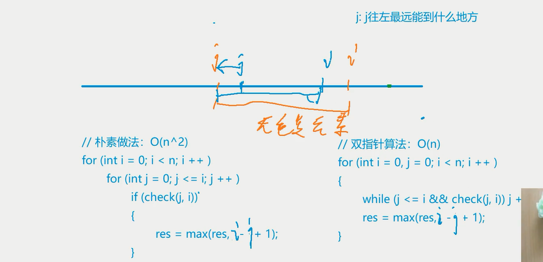
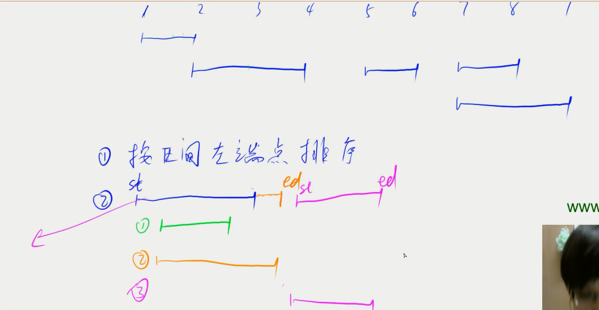

## 双指针算法

所有的双指针算法都是 O(n)
将暴力算法 O(n^2) ---> O(n)

[双指针算法](./双指针算法.cpp)

[最长连续不重复子序列](./最长连续不重复子序列.cpp)


```
799.最长连续不重复子序列
给定一个长度为n的整数序列，请找出最长的不包含重复数字的连续子序列，输出它的长度。
输入格式
第一行包含整数
第二行包含n个整数（均在0~100000范围内）,表示整数序列。
输出格式
共一行，包含一个整数，表示最长的不包含重复数字的连续子序列的长度。
数据范围
1≤n≤100000
输入样例：
5
12235
输出样例：
3
```

## 位运算

源码 反码 补码

n 的二进制表述中，第 k 位是几 ---> n >> k & 1

lowbit(x) 返回 x 的最后一位 1（包括 1 后面的零）x&-x

[二进制中一的个数](./二进制中一的个数.cpp)

## 离散化

映射的过程称为离散化

```cpp
vector<int> alls;                                         // 存储所有待离散化的值
sort(alls.begin(), alls.end());                           // 将所有值排序
alls.erase(unique(alls.begin(), alls.end()), alls.end()); // 去掉重复元素
```

二分求出 x 对应的离散化的值

```cpp
int find(int x) // 找到第一个大于等于x的位置
{
    int l = 0, r = alls.size() - 1;
    while (l < r)
    {
        int mid = l + r >> 1;
        if (alls[mid] >= x)
            r = mid;
        else
            l = mid + 1;
    }
    return r + 1; // 映射到1, 2, ...n
}
```

[802.区间和](./区间和.cpp)

```
802.区间和
假定有一个无限长的数轴，数轴上每个坐标上的数都是 0
现在，我们首先进行 n 次操作，每次操作将某一位置 × 上的数加 c。
近下来，进行 m 次询问，每个询问包含两个整数和，你需要求出在区间[l,r]之间的所有数的和。
输入格式
第一行包含两个整数 n 和 m。
接下来 n 行，每行包含两个整数 x 和 c。
再接下里 m 行，每行包含两个整数和 r.
输出格式
共 m 行，每行输出一个询问中所求的区间内数字和。

```

[格子染色](https://www.acwing.com/problem/content/761/)

## 区间合并


[区间合并](./区间合并.cpp)
