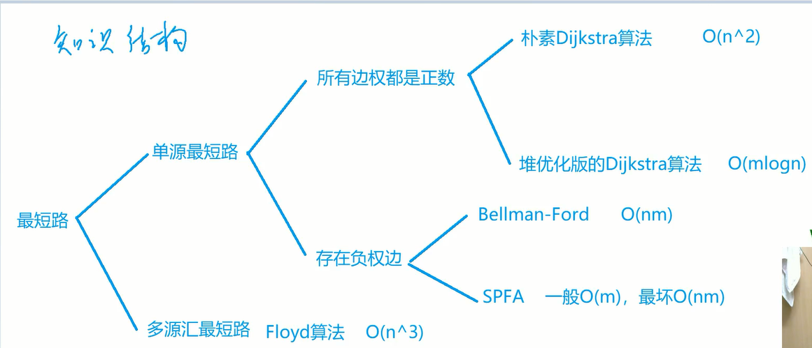
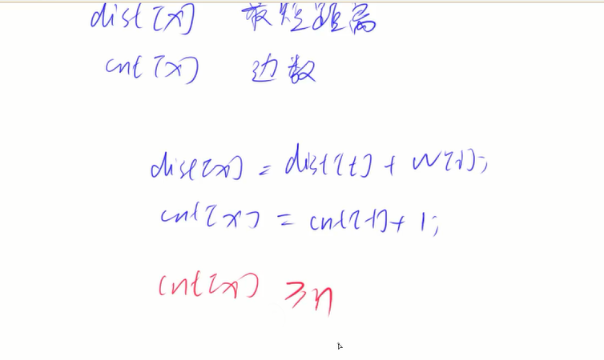
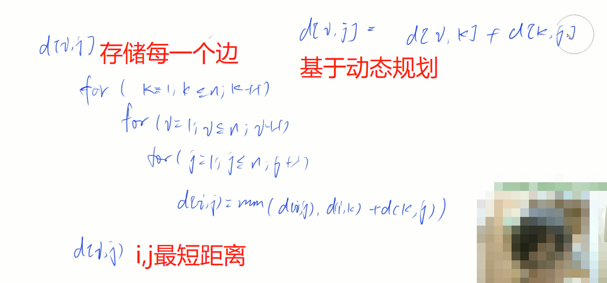

## 最短路算法 

稠密图 --- 边很多 --- m~n^2 

难点在于建模！

常见的最短路问题：
   1. 单源最短路    --- 一个点到其他点的最短距离
    + 所有边权都是正数
        - 朴素Djikstra算法 --- O(n^2) 稠密图 (基于贪心算法)
        - 堆优化Djikstra算法 --- O(mlogn) 稀疏图
    + 存在负权边
        - Bellman-Ford算法 --- O(nm)
        - SPFA算法 --- 一般情况下O(m)，最坏情况O(nm)
   2. 多源汇最短路   --- 起点和终点都是不确定的
    + Floyd算法 --- O(n^3)  (基于动态规划)

### 朴素Djikstra算法

[849. Dijkstra求最短路 I](https://www.acwing.com/problem/content/description/851/)

set s --- 当前已经确定最短距离的点

1. 初始化距离 dist[1] = 0; dist[i] = +infinite
2. for(i: 1 ~ n) 
   不在s中的，距离最近的点->t
   t -> s
   用t更新其他点的距离 （判断dist[x]>dist[t]+w）

### Bellman-Ford算法
    for n 次
        for 所有边 a--w->b  --->(松弛操作)
                dist[b] = min(dist[b],dist[a]+w);
存储边：struct{int a,b,w} 

循环结束后 对所有边都满足 dist[b]<=dist[a]+w  ---> 三角不等式

### SPFA 算法    (Shortest Path Faster Algorithm)    

[851. spfa求最短路](https://www.acwing.com/problem/content/853/)

### 找负环

[AcWing 852. spfa判断负环](https://www.acwing.com/solution/content/6975/)

### Floyd算法

[AcWing 854. Floyd求最短路](https://www.acwing.com/solution/content/6976/)

