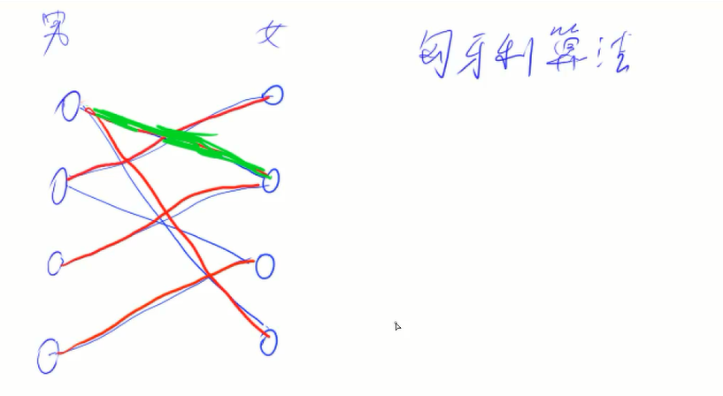

## 最小生成树
1. 普利姆（Prim）算法
    + 朴素Prim O(n^2) --- 稠密图
        [AcWing 858. Prim算法求最小生成树](https://www.acwing.com/solution/content/18373/)

    + 堆优化Prim O(mlogn)

2. 克鲁斯卡尔（Kruskal）算法 O(mlogm) --- 稀疏图

[AcWing 859. Kruskal算法求最小生成树](https://www.acwing.com/solution/content/18379/)

## 二分图 
> 可以把图中的点分成两个集合，使得一个集合内部的点中互相没有边连接，只在两个集合之间有边连接
1. 染色法 O(m+n)
    判断一个图是不是二分图
    一个图是二分图，当且仅当图中不含有奇数环（环当中的边的数量是奇数）

2. 匈牙利算法 最坏O(mn) 一般远小于O(mn)

[AcWing 860. 染色法判定二分图](https://www.acwing.com/solution/content/6350/)
[257. 关押罪犯](https://www.acwing.com/problem/content/259/)
[AcWing 861. 二分图的最大匹配](https://www.acwing.com/solution/content/17611/)
[372. 棋盘覆盖](https://www.acwing.com/problem/content/374/)