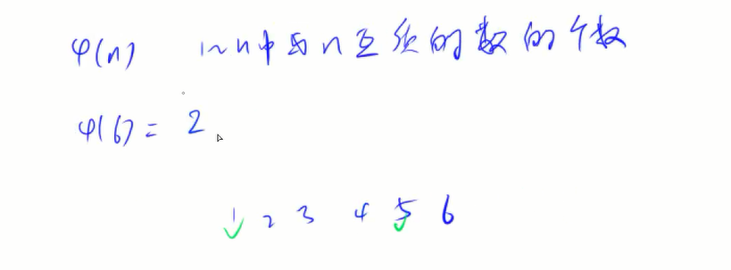
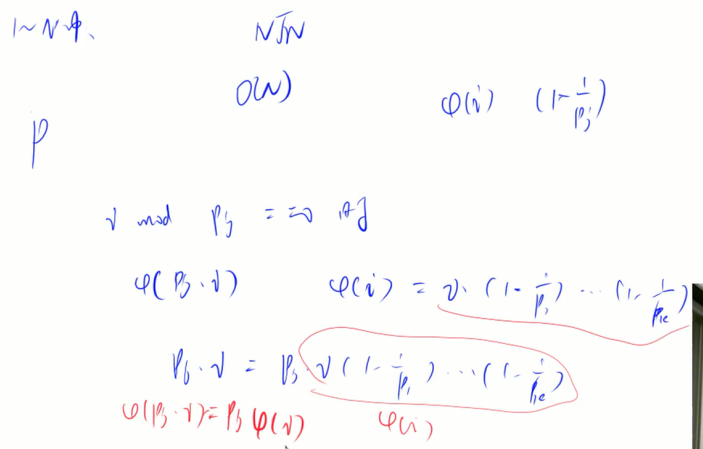
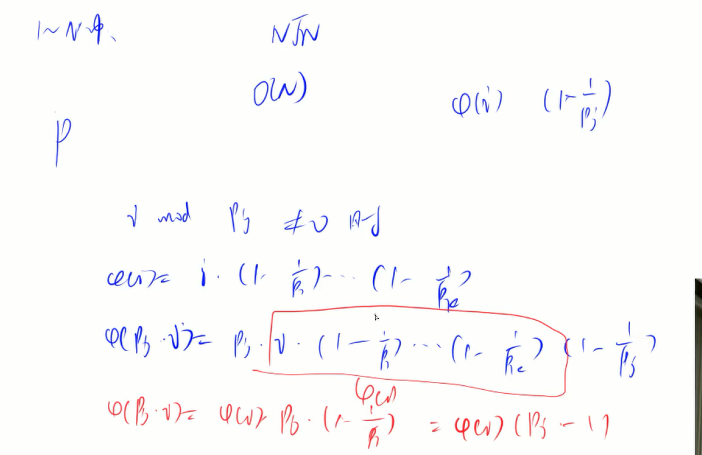

## 数论
    1. 质数
        在大于1的整数中，如果只包含1和它本身两个公约数，即质数
        + 质数的判定 --- 试除法 O(n) O(n^1/2)
        + 分解质因数 --- 试除法 O(nlogn) O(nloglogn)
        + 筛法
            - 埃氏筛法
            - 线性筛法

    2. 约数
        + 试除法求所有约数 
        + 约数个数 --- 
        + 约数之和 ---
        + 最大公约数 --- 欧几里得算法（辗转相除法）

    3. 欧拉函数
        

    4. 快速幂
    5. 扩展欧几里得算法
    6. 中国剩余定理
## 组合计数
## 高斯消元
## 简单博弈论

[AcWing 867. 分解质因数](https://www.acwing.com/solution/content/18444/)
[AcWing 868. 筛质数](https://www.acwing.com/solution/content/12792/)
[AcWing 873. 数论-欧拉函数](https://www.acwing.com/solution/content/21569/)
[AcWing 874. 筛法求欧拉函数](https://www.acwing.com/solution/content/3952/)

