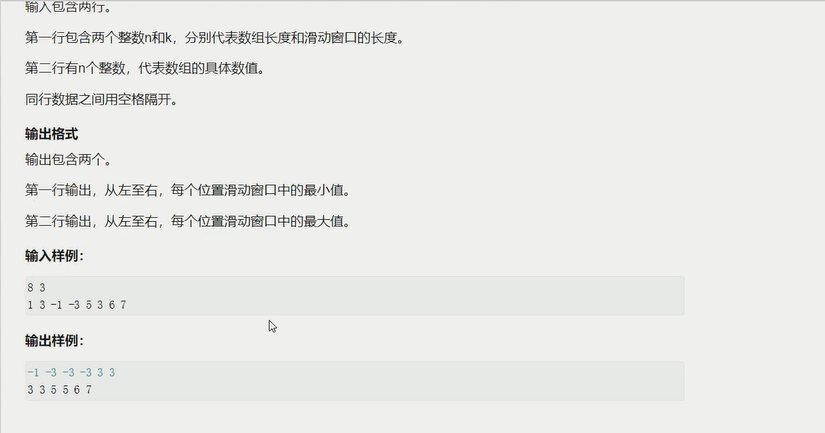

链表与邻接表

数组模拟单链表 ----> 邻接表 -----> 树，图
[单链表](./单链表.cpp)

```
826.单链表
实现一个单链表，链表初始为空，支持三种操作：
(1)向链表头插入一个数
(2)删除第k个插入的数后面的数；
(3)在第k个插入的数后插入一个数
现在要对该链表进行M次操作，进行完所有操作后，从头到尾输出整个链表。
注意：题目中第k个插入的数并不是指当前链表的第k个数。例如操作过程中一共插入了n个数，则按照插入的时间顺序，这个数依次为：第1个插入的数，第2个插入的数，第个插入的数。
输入格式
第一行包含整数M,表示操作次数。
接下来M行，每行包含一个操作命令，操作命令可能为以下几种
(1)"H x",表示向链表头插入一个数x。
(2)"D k",表示删除第k个输入的数后面的数（当k为0时，表示删除头结点）
(2)l k x",表示在第k个输入的数后面插入一个数x(此操作中k均大于0)。
```


数组模拟单链表 ----> 优化某些问题

栈与队列

```cpp
const int N = 100010;

// *************************************************************栈

int stk[N], tt;

// 插入；
stk[++tt] = x;

// 弹出
tt--;

//判断栈是否为空
if(tt>0) not empty
else empty

//栈顶
stk[tt];

// *************************************************************队列

//在队尾插入元素，在队头弹出元素
int q[N], hh, tt=-1;

//插入
q[++tt] = x;

// 弹出
hh++;

//判断是否为空
if(hh<=tt) not empty;
else empty;

//取出队头元素
q[hh]
```

单调栈

```
给定一个长度为N的整数数列，输出每个数左边第一个比它小的数，如果不存在则输出-1
输入格式
第一行包含整数N,表示数列长度。
第二行包含N个整数，表示整数数列。
输出格式
共一行，包含N个整数，其中第个数表示第个数的左边第一个比它小的数，如果不存在则输出-1.
```

单调队列




kmp
