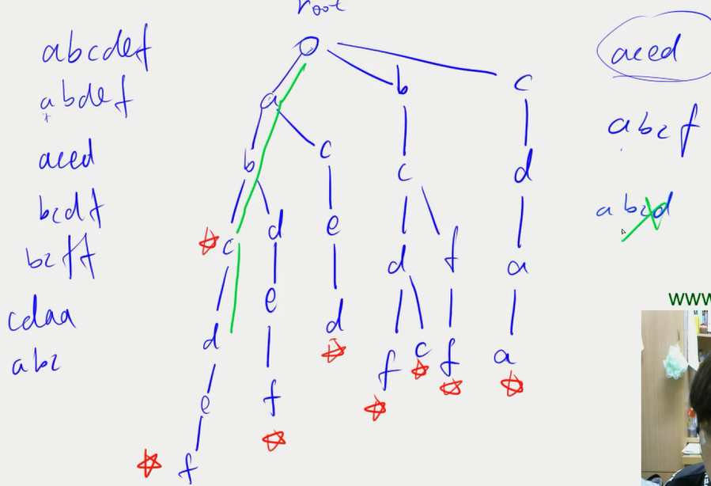

# Trie

用来高效的`存储`和`查找`字符串集合的数据结构

[AcWing 835. Trie 字符串统计](https://www.acwing.com/solution/content/3531/) 
[143. 最大异或对](https://www.acwing.com/problem/content/145/)

# 并查集

1. 将两个集合合并
2. 询问两个元素是否在一个集合当中

`基本原理：`每个集合用一棵树来表示。树根的编号就是整个集合的编号。每个节点存储它的父节点，p[x]表示它的父节点

q1: 如何判断树根？
if(p[x] == x)
q2: 如何求 x 的集合编号？
while(p[x] != x) x=p[x];
q3: 如何合并两个集合？
x 是 x 的集合编号，y 是 y 的集合编号。合并：p[x] = y;

优化 q2：当一个节点查询完集合编号时，将其在查询时所经过的路径上的所有的节点直接连到祖先节点下面（`路径压缩`）

[836.合并集合](https://www.acwing.com/problem/content/838/)
[AcWing 837.连通块中点的数量](https://www.acwing.com/solution/content/18132/)
[240.食物链](https://www.acwing.com/problem/content/242/)

# 堆

堆是一棵完全二叉树

小根堆--> 每个节点都小于自己的子结点--> 根节点是最小值 大根堆

`堆的操作`

1. 插入一个数 heap[++size]=x;up(size);
2. 求集合当中的最小值 heap[1];
3. 删除最小值 heap[1]=heap[size];size--;down(1);
4. 删除任意一个元素 heap[k]=heap[size];size--;down(k);up(k);
5. 修改任意一个元素 heap[k]=x;down(k);up(k);
   down(x) up(x)

`堆的存储`

数组模拟 根节点编号为 1 ，编号为 x 的左子节点 2x，编号为 x 的右子节点 2x+1

[838. 堆排序](https://www.acwing.com/problem/content/840/)
[AcWing 839. 模拟堆](https://www.acwing.com/solution/content/5143/)
