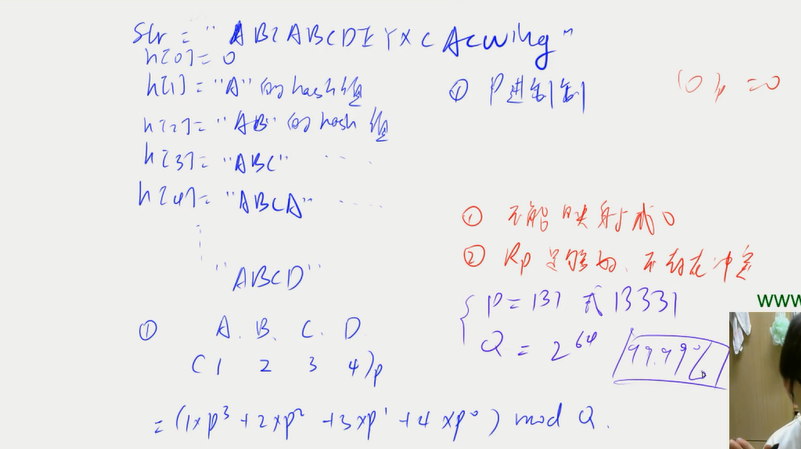
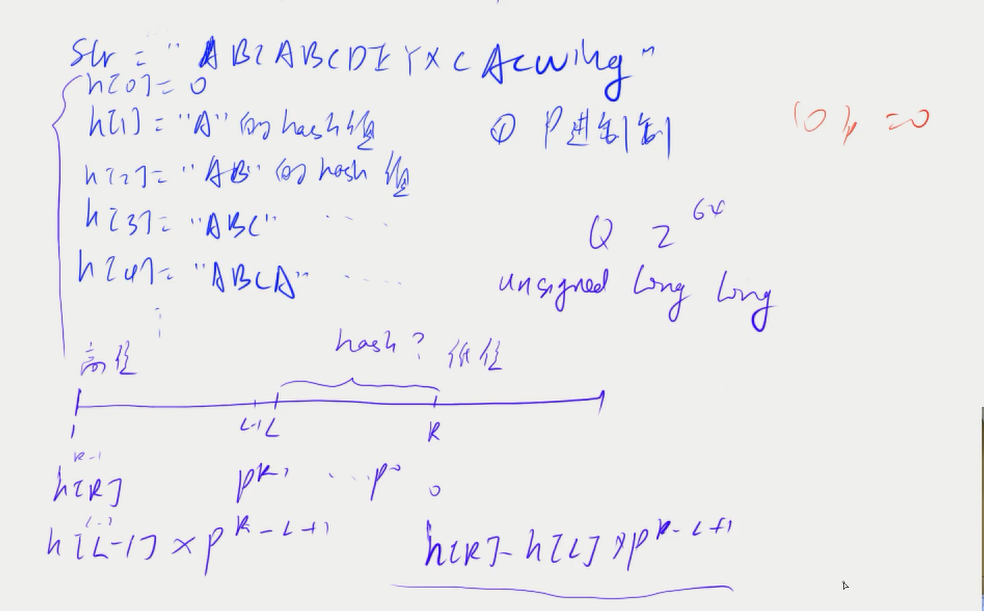

# 数据结构 3

## 哈希表

`哈希冲突`

**解决哈希冲突的方法**

1. 开放寻址法

2. 拉链法

[AcWing 840. 模拟散列表](https://www.acwing.com/solution/content/15765/)

**字符串哈希方式：**

_字符串前缀哈希法：_



[字符串哈希](https://www.acwing.com/solution/content/3613/)

## STL

> 系统为某一个程序分配空间时，所需要的时间与申请的空间大小无关，而与申请的次数有关

```cpp
vector  变长数组， 倍增思想 size(), empty(), clear(), front(), back(), push_back()/pop_back()
支持比较运算（字典序）

pair<int,int> 队组 first(), second() make_pair(a,b)/{a,b}-->构造pair

string  字符串， substr(), c_str(), size()/length(), empty(), clear(), +,

queue   队列， push(), front(), pop(), back(), size(), empty()

priority_queue 优先队列（默认是大根堆）， push(), top(), pop(), //定义一个小根堆 priority_queue<int,vector<int>,greater<int> >heap;

stack   栈， push(), top(), pop()

deque   双端队列（加强版vector），size(), empty(), clear(), front(), back(), push_back()/pop_back(), push_front()/pop_front(), []

set, map, multiset, multimap    基于平衡二叉树（红黑树），动态维护有序序列  size(),empty(),clear()

set/multiset:  insert(), find(), count(), erase(), lower_bound(x)返回大于等于x的最小的数的迭代器/upper_bound()返回大于x的最小的数的迭代器

map/multimap:   insert(pair), erase(), find(), [], lower_bound()/upper_bound()

unordered_set, unordered_map, unordered_multiset, unordered_multimap    基于哈希表
与上面类似，但是怎删改查的时间复杂度都是O(1) 不支持 lower_bound()和upper_bound(), 不支持迭代器的++，--

bitset  压位, 声明：bitset<10000> S; ~,^,&,|,>>,<<,[],count()返回由多少位1，any()是否至少有一个1/none()是否全为0，set()把所有位置为1，set(k,v)将第k位变为v，reset()把所有位变成0，flip()把所有位取反，flip(k)把第k位取反


```
